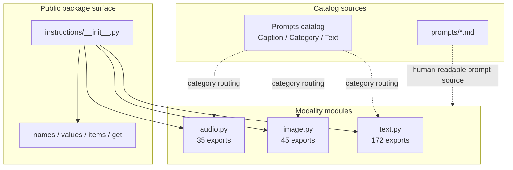
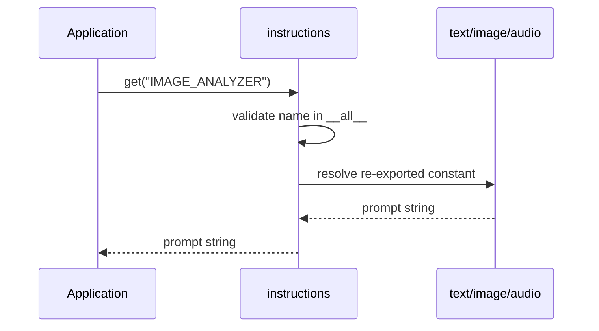

# Architecture

Guro separates **prompt content**, **modality ownership**, and **public discovery**. The package is intentionally simple: prompt values remain plain Python strings, while module boundaries provide organization and predictable imports.

## Component Model

## Responsibilities

| Component | Responsibility |
|---|---|
| `instructions/__init__.py` | Unified compatibility surface; re-exports all supported constants and package-level helpers. |
| `instructions/text.py` | Text-centric instruction catalog and text-scoped helpers. |
| `instructions/image.py` | Image generation, analysis, and editing instruction catalog. |
| `instructions/audio.py` | Translation, transcription, and speech instruction catalog. |
| `Prompts` catalog | Category metadata used to determine module ownership. |
| `prompts/` | Human-readable prompt documents maintained alongside Python exports. |

## Lookup Flow

## Public API Invariants

The documentation assumes the following invariants remain true:

1. Every name in package-level `__all__` resolves to a string constant.
2. Every constant belongs to exactly one modality module.
3. The union of submodule `__all__` tuples equals package-level `__all__`.
4. `names()`, `values()`, and `items()` preserve the declared public order.
5. `get()` rejects undefined or non-public names with `KeyError`.
6. Prompt Markdown remains data; helper functions do not modify prompt text.

!!! warning "Do not duplicate prompt ownership"
    A prompt should be exported from exactly one of `text.py`, `image.py`, or `audio.py`. The package-level module may re-export it, but two modality modules should never independently define the same public constant.

## Category Routing

| Category | Owner | Count |
|---|---|---:|
| Research / Academic | `text.py` | 32 |
| Prompt Engineering | `text.py` | 5 |
| Writing / Administrative | `text.py` | 35 |
| Compliance / Legal / Budget | `text.py` | 9 |
| Business / Finance / Marketing | `text.py` | 19 |
| Software Engineering | `text.py` | 25 |
| Software Engineer | `text.py` | 10 |
| Data Analytics & Governance | `text.py` | 32 |
| Instruction/ Training / Planning | `text.py` | 5 |
| Image Generation | `image.py` | 23 |
| Image Analysis | `image.py` | 9 |
| Image Editing | `image.py` | 13 |
| Translation API | `audio.py` | 14 |
| Transcription API | `audio.py` | 11 |
| Speech API | `audio.py` | 10 |

For the maintenance rules behind this table, see [Category Routing](development/category-routing.md).
