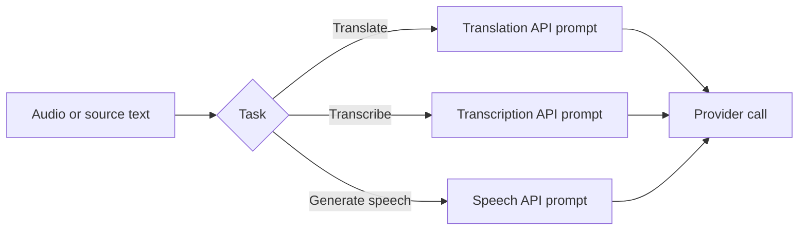

# Audio Instructions

`instructions.audio` contains **35** prompts for translation, transcription, and speech workflows.

## Categories

| Category | Count |
|---|---:|
| Translation API | 14 |
| Transcription API | 11 |
| Speech API | 10 |

## Translation

```python
from instructions.audio import TECHNICAL_DOCUMENTATION_TRANSLATOR

instruction = TECHNICAL_DOCUMENTATION_TRANSLATOR
```

## Transcription

```python
from instructions.audio import VERBATIM_TRANSCRIBER

instruction = VERBATIM_TRANSCRIBER
```

## Speech

```python
from instructions.audio import NARRATION_DIRECTOR

instruction = NARRATION_DIRECTOR
```

## Workflow



!!! note
    Audio prompts do not replace provider-specific parameters such as language codes, voice IDs, timestamps, audio formats, diarization controls, or file transport.
