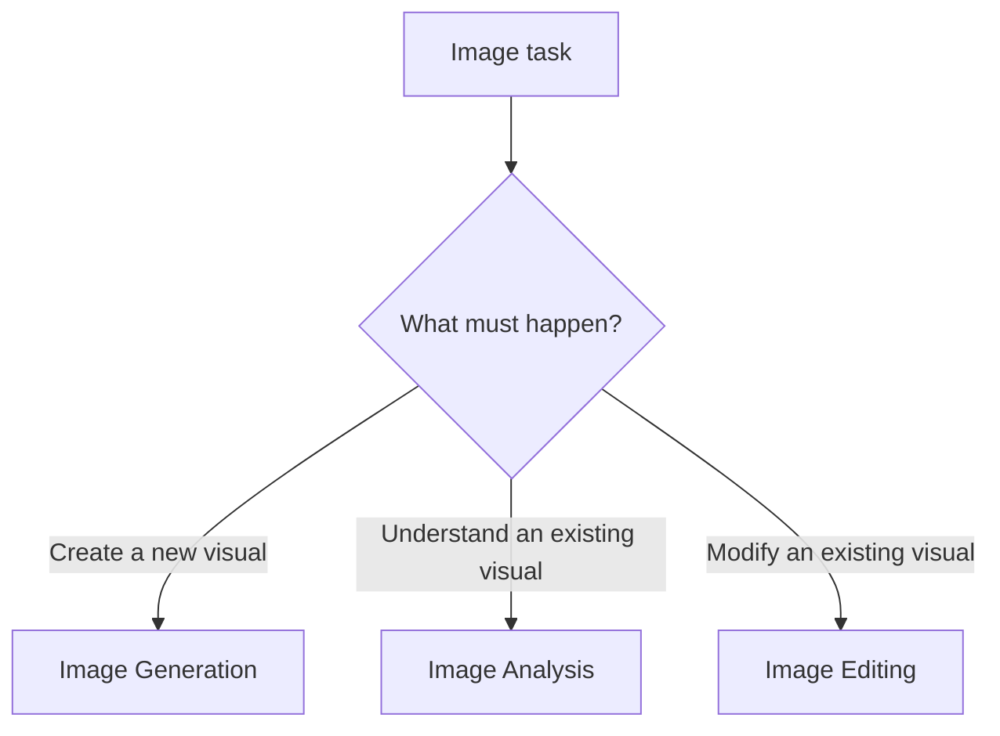

# Image Instructions

`instructions.image` contains **45** prompts across image generation, image analysis, and image editing.

## Categories

| Category | Count |
|---|---:|
| Image Generation | 23 |
| Image Analysis | 9 |
| Image Editing | 13 |

## Generation Example

```python
from instructions.image import REALISTIC_IMAGE_JSON_PROMPT

image_instruction = REALISTIC_IMAGE_JSON_PROMPT
```

## Analysis Example

```python
from instructions.image import IMAGE_ANALYZER

analysis_instruction = IMAGE_ANALYZER
```

## Editing Example

```python
from instructions.image import GENERAL_PURPOSE_IMAGE_EDITOR

edit_instruction = GENERAL_PURPOSE_IMAGE_EDITOR
```

## Selection Guidance



!!! note
    These constants provide instruction text. Provider-specific image bytes, masks, URLs, file IDs, dimensions, and model parameters remain the responsibility of the calling application.
