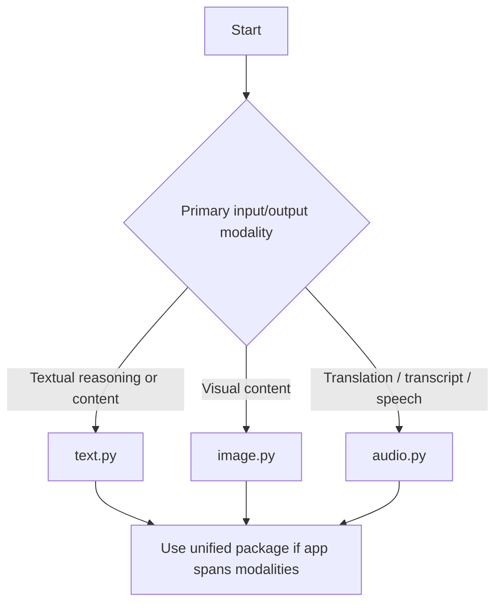

# Choosing the Right Module

Use the prompt category—not merely the wording of a prompt name—to select the owning module.

| Need | Module |
|---|---|
| Research, writing, finance, engineering, analytics, governance, training, planning | `text.py` |
| Generate, analyze, or edit images | `image.py` |
| Translate, transcribe, narrate, or synthesize speech | `audio.py` |

## Decision Tree

## Cross-Modality Applications

A single application can legitimately use all three modules. For example, a document workflow might:

1. use an image-analysis prompt to interpret a scanned figure;
2. use a text prompt to summarize the surrounding document; and
3. use a speech prompt to narrate the resulting summary.

In that case, importing the package-level compatibility surface is appropriate.
