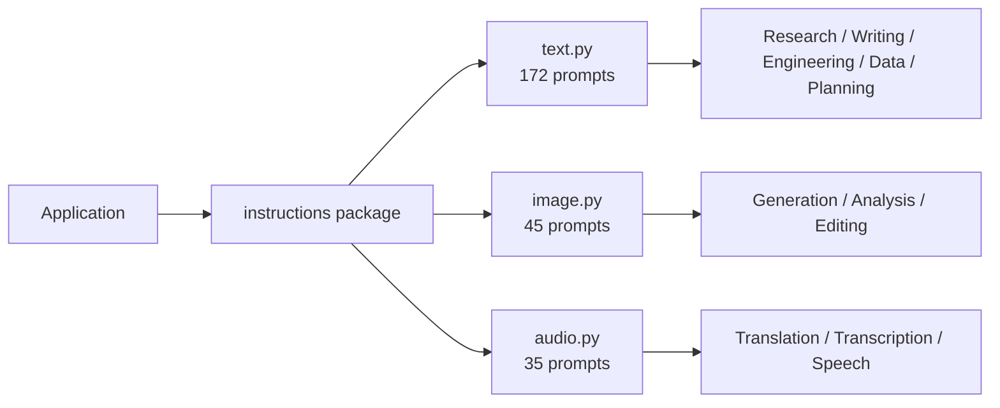

# Guro

**Guro** is a reusable prompt and skill engineering library for AI agents, assistants, and application workflows. The instruction catalog is organized by modality so applications can use text, image, and audio instructions independently or through one unified package.

<div class="grid cards" markdown>

-   **252 instruction prompts**

    ---

    A concrete, importable Python symbol for every supported instruction.

-   **172 text instructions**

    ---

    Research, writing, finance, software engineering, analytics, governance, planning, and prompt engineering.

-   **45 image instructions**

    ---

    Image generation, image analysis, and image editing workflows.

-   **35 audio instructions**

    ---

    Translation, transcription, and speech workflows.

</div>

[Get started](getting-started.md){ .md-button .md-button--primary }
[Browse all prompts](reference/catalog.md){ .md-button }

## Package Architecture



## Why Guro Is Structured This Way

The original catalog was a single large `instructions.py` module. Guro now uses an `instructions/` package so modality-specific code can remain isolated while preserving a unified import surface. The package-level `__init__.py` re-exports the complete catalog and exposes `names()`, `values()`, `items()`, and `get()` for discovery and runtime lookup.

```python
from instructions import ACADEMIC_WRITER, IMAGE_ANALYZER, VERBATIM_TRANSCRIBER
from instructions import get, names
```

You can also import only the modality required by an application:

```python
from instructions import text, image, audio
```

## Category Routing

| Prompt Category | Module | Exported Prompts |
|---|---|---:|
| Research / Academic | `text.py` | 32 |
| Prompt Engineering | `text.py` | 5 |
| Writing / Administrative | `text.py` | 35 |
| Compliance / Legal / Budget | `text.py` | 9 |
| Business / Finance / Marketing | `text.py` | 19 |
| Software Engineering | `text.py` | 25 |
| Software Engineer | `text.py` | 10 |
| Data Analytics & Governance | `text.py` | 32 |
| Instruction/ Training / Planning | `text.py` | 5 |
| Image Generation | `image.py` | 23 |
| Image Analysis | `image.py` | 9 |
| Image Editing | `image.py` | 13 |
| Translation API | `audio.py` | 14 |
| Transcription API | `audio.py` | 11 |
| Speech API | `audio.py` | 10 |
| **Total** | **All modules** | **252** |

## Documentation Map

- **Getting Started** covers installation, imports, and first use.
- **Architecture** explains package boundaries and lookup flow.
- **User Guide** covers each modality and common integration patterns.
- **Prompt Catalog** provides a searchable inventory of every exported instruction.
- **API Reference** documents the package and helper functions.
- **Development** explains how to add prompts without breaking routing or the public API.
