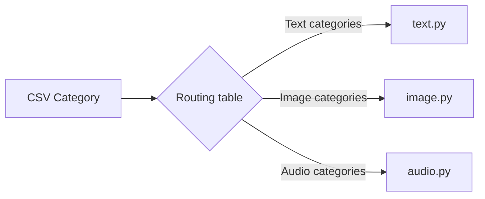

# Categories & Routing

The prompt catalog uses category metadata to assign each instruction to one modality module. Routing is deterministic and should be treated as part of the public organization contract.

| Category | Module | Exported Prompts |
|---|---|---:|
| Research / Academic | `text.py` | 32 |
| Prompt Engineering | `text.py` | 5 |
| Writing / Administrative | `text.py` | 35 |
| Compliance / Legal / Budget | `text.py` | 9 |
| Business / Finance / Marketing | `text.py` | 19 |
| Software Engineering | `text.py` | 25 |
| Software Engineer | `text.py` | 10 |
| Data Analytics & Governance | `text.py` | 32 |
| Instruction/ Training / Planning | `text.py` | 5 |
| Image Generation | `image.py` | 23 |
| Image Analysis | `image.py` | 9 |
| Image Editing | `image.py` | 13 |
| Translation API | `audio.py` | 14 |
| Transcription API | `audio.py` | 11 |
| Speech API | `audio.py` | 10 |
| **Total** | | **252** |

## Routing Rules

### Text

The following categories route to `text.py`:

- Research / Academic
- Prompt Engineering
- Writing / Administrative
- Compliance / Legal / Budget
- Business / Finance / Marketing
- Software Engineering
- Software Engineer
- Data Analytics & Governance
- Instruction/ Training / Planning

### Image

The following categories route to `image.py`:

- Image Generation
- Image Analysis
- Image Editing

### Audio

The following categories route to `audio.py`:

- Translation API
- Transcription API
- Speech API
