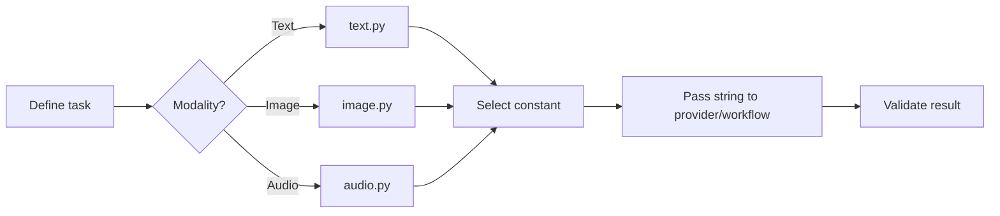

# User Guide

Guro exposes instruction prompts as plain Python strings, but the catalog is large enough that **how you select and import a prompt matters**. This guide focuses on production usage patterns rather than merely listing constants.

## Choose an Access Pattern

| Scenario | Recommended Pattern |
|---|---|
| One known prompt | Import the constant directly from its modality module. |
| Several prompts from one modality | Import `text`, `image`, or `audio` and use module attributes. |
| User-selectable prompt | Populate the UI with `names()` and resolve the selection with `get()`. |
| Configuration-driven prompt | Store the uppercase public name and call `get()` at runtime. |
| Cross-modality application | Use the package-level `instructions` compatibility surface. |
| Need every `(name, value)` pair | Use `items()` rather than inspecting `globals()`. |

## Core Workflow

## Guides

- [Text Instructions](guides/text.md)
- [Image Instructions](guides/image.md)
- [Audio Instructions](guides/audio.md)
- [Discovery & Dynamic Lookup](guides/discovery.md)
- [Integrating with LLM APIs](guides/integration.md)
- [Choosing the Right Module](guides/module-selection.md)
